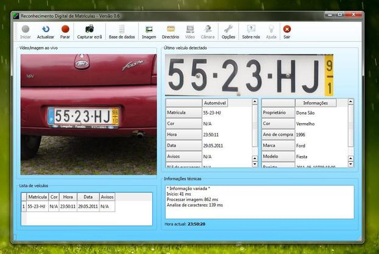
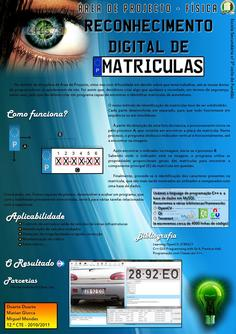

Reconhecimento Digital de Matrículas
====================================

*Computer Vision - License Plate Recognition*
---------------------------------------------

__Área de Projecto - ESF - 12.º ano__

Sumário
=======

Projecto com o objectivo de criar um *software* capaz de analisar uma imagem, vídeo ou *webcam* e identificar as matrículas automóveis presentes.
Posteriormente, é feito uma comparação dessa informação com uma base de dados.

Mais informação: [relatório final](docs/RDM_RelatorioFinal.pdf) (pdf)

Tecnologias
===========

* [Qt](http://qt.nokia.com/): interface gráfica
* [OpenCV](http://opencv.willowgarage.com/wiki/): identificação da matrícula
* [Tessaract-ocr](http://code.google.com/p/tesseract-ocr/): análise de caracteres
* [MySQL](http://www.mysql.com/): Base de dados

Autores
=======

- [Duarte Duarte](https://github.com/DDuarte)
- [Miguel Mendes](https://github.com/zephiro309)

Interface
=========

Licença
=======

>RDM - Reconhecimento Digital de Matriculas
>Copyright (C) 2011  Duarte Duarte, Miguel Mendes
>
>This program is free software: you can redistribute it and/or modify
>it under the terms of the GNU General Public License as published by
>the Free Software Foundation, either version 3 of the License, or
>(at your option) any later version.
>
>This program is distributed in the hope that it will be useful,
>but WITHOUT ANY WARRANTY; without even the implied warranty of
>MERCHANTABILITY or FITNESS FOR A PARTICULAR PURPOSE.  See the
>GNU General Public License for more details.
>
>You should have received a copy of the GNU General Public License
>along with this program.  If not, see <http://www.gnu.org/licenses/>.
>
>We are not to be held liable for any illegal use of this software.

----------

2010/2011
